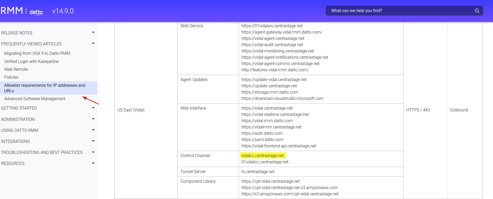

## Introduction

Remote Monitoring and Management (RMM) software is widely used by IT administrators to manage endpoints, execute commands, and maintain infrastructure at scale. Platforms such as [Datto RMM](https://www.datto.com/) provide full remote access capabilities over trusted channels, typically HTTPS.

In recent years, threat actors have increasingly abused these tools to gain stealthy and persistent access to victim systems. This technique, known as **RMM abuse**, is part of a Living-off-the-Land approach where legitimate software is used instead of custom malware, making detection more challenging.

This trend has been documented by the Cybersecurity and Infrastructure Security Agency (CISA) in advisory [AA23-025A](https://media.defense.gov/2023/Jan/25/2003149873/-1/-1/0/JOINT_CSA_RMM.PDF), which highlights the use of remote access tools in phishing campaigns to establish persistence.

In this context, legitimate RMM software effectively becomes an **RMM backdoor**, providing attackers with full remote control through trusted infrastructure.

This report analyzes a malicious sample referred to as **ZoomLure**, observed in an active campaign leveraging a fake Zoom update to deploy a Datto RMM agent and establish persistent access.

## Delivery / Initial Access

The infection begins with a social engineering lure impersonating a legitimate Zoom update. Victims are directed to a malicious website that mimics a software update portal, convincing them to download what appears to be a required meeting update.

Notably, the observed portal appears to reference or impersonate infrastructure associated with the Port of Portland. Elements within the page, including naming conventions in the URL, suggest an attempt to increase credibility by leveraging a legitimate organization.
<p align="center">

</p>

The downloaded file, named `Zoom_Meeting_Update`, is presented as a legitimate installer. However, it is in fact a malicious NSIS self-extracting archive containing the Datto RMM payload.

This technique relies heavily on user trust and familiarity with Zoom, combined with contextual legitimacy through organizational impersonation. By avoiding obvious malicious indicators and using a plausible filename and environment, the attacker reduces suspicion during the initial access phase.

### Social Engineering Observations

- Use of a well-known brand (Zoom)
- Possible impersonation of a legitimate organization (Port of Portland)
- Use of a believable update scenario
- Minimal friction to download and execute
- Lack of obvious malicious indicators during initial interaction

## Attack Flow

The following diagram summarizes the infection chain observed in the ZoomLure campaign:

<p align="center">

</p>

## NSIS Archive Analysis

The sample is a Nullsoft Scriptable Install System (NSIS) self-extracting archive. Although NSIS is commonly used for legitimate software distribution, it is also frequently abused to package and deploy multi-component malware.

In this case, the installer does not immediately expose its malicious functionality. Instead, the outer executable acts as a container for a larger set of embedded components, which only become visible after enumeration and extraction.

A quick file identification confirms the use of an NSIS installer:

```bash
file Zoom_Meeting_Update
```
<p align="center">

</p>

This is an important detail because it explains why the sample appears relatively generic during initial static inspection. Much of the relevant functionality is compressed within the archive rather than exposed directly in the outer binary.

Enumerating the archive contents reveals that the sample contains far more than a single dropped payload:

```bash
7z l Zoom_Meeting_Update
```
The archive includes executables, DLLs, and configuration files associated with Datto RMM, including `CagService.exe`, `CsExec.Service.exe`, and `Gui.exe`. This strongly suggests that the installer is intended to deploy a complete remote management stack rather than a simple loader.

Once extracted, the full structure becomes clearer:
```bash
7z x Zoom_Meeting_Update -o./extracted
```
<p align="center">

</p>

The extracted contents show a complete deployment package containing service binaries, remote access components, and configuration files. At this stage, the sample is better understood as a packaged Datto RMM installation delivered through a malicious NSIS wrapper.

This packaging choice also has detection implications. Because the outer binary is a common NSIS stub and the core artifacts are embedded internally, generic signatures against the wrapper are less reliable. In practice, analysis and detection are more effective once focused on the extracted payload, configuration files, and resulting host and network artifacts.


## Payload Analysis: Datto RMM (CentraStage)

After extracting the NSIS archive, the payload reveals itself as a full Datto RMM (CentraStage) agent deployment. Rather than introducing custom malware, the installer deploys a legitimate remote management platform configured under attacker control.

This approach shifts the analysis focus from binary-level indicators to configuration, persistence, and operational artifacts.


### Identifying the Core Backdoor Component

The most critical component is `CagService.exe`, which acts as the primary service responsible for maintaining persistence and communicating with the remote infrastructure.

Its associated configuration file contains the most valuable network indicators:

```bash
grep -E 'CsIp|CsTcpPort"|AccountUid|name="Profile"' -A1 CagService.exe.config | grep -v '^--$'
```
<p align="center">

</p>

From this file, we can directly extract:

- **C2 Domain:** `vidalcc.centrastage.net`
- **Port:** `443`
- **Account UID:** `vidc6c90001`
- **Profile GUID:** `f459e024-ee5f-4e08-9410-29cdb32263de`

These values are not obfuscated and represent the attacker-controlled Datto RMM tenant.

### Persistence Mechanisms

The sample establishes persistence through multiple mechanisms, combining Windows services, registry keys, and Safe Mode configuration. Rather than relying on a single technique, the Datto RMM agent uses redundancy to ensure long-term access.

#### Windows Service Persistence

The primary persistence mechanism is implemented through a Windows service:

- **Service Name:** `CagService`
- **Display Name:** `CentraStage Service`
- **Start Type:** Automatic
- **Execution Path:** `%PROGRAMFILES%\CentraStage\CagService.exe`

This service ensures the agent is executed at system startup and maintains communication with the remote infrastructure.

Additional service components such as `CsExecService` and `CsDeployService` are also present, enabling command execution and deployment functionality.


While the service represents the primary persistence mechanism, additional artifacts related to registry keys and Safe Mode configuration were also identified during analysis.

These artifacts are summarized in the table below, providing a consolidated view of persistence-related indicators.

### Persistence Artifacts Summary

| Type        | Artifact                                                                 | Description |
|------------|-------------------------------------------------------------------------|------------|
| Service    | `CagService`                                                            | Primary service responsible for persistence and C2 communication |
| Service    | `CsExecService`                                                         | Enables remote command execution |
| Service    | `CsDeployService`                                                       | Handles deployment and update operations |
| Registry   | `HKLM\SOFTWARE\Microsoft\Windows\CurrentVersion\Run\CentraStage`        | Ensures execution of the agent at user logon |
| Registry   | `HKLM\SOFTWARE\CentraStage`                                             | Base configuration key for the agent |
| SafeBoot   | `SYSTEM\CurrentControlSet\Control\SafeBoot\Network\CagService`           | Forces service execution in Safe Mode with Networking |
| SafeBoot   | `SYSTEM\CurrentControlSet\Control\SafeBoot\Network\uvnc_service`         | Enables remote access (VNC) in Safe Mode |
| File System| `%PROGRAMFILES%\CentraStage\`                                           | Main installation directory containing binaries and configs |
| File System| `C:\ProgramData\Microsoft\Windows\Start Menu\Programs\CentraStage\`      | Start Menu entries mimicking legitimate software installation |


## C2 Infrastructure and Tenant Abuse

While the configuration file exposes the connection parameters, the most important aspect is how this infrastructure operates.

Unlike traditional malware, the agent does not communicate with a dedicated attacker-controlled server. Instead, it connects to legitimate Datto RMM infrastructure.


### Abuse of Legitimate RMM Infrastructure

The domain:

- `vidalcc.centrastage.net`

is part of [Datto RMM’s cloud platform](https://rmm.datto.com/help/en/Content/1INTRODUCTION/Requirements/AllowListRequirements.htm?Highlight=allowlist).

<p align="center">

</p>

The subdomain (`vidalcc`) represents a specific tenant within the platform, meaning that the attacker has registered or compromised a Datto RMM account and is using it to manage infected systems.

The following identifiers further confirm this:

- **Account UID:** `vidc6c90001`
- **Profile GUID:** `f459e024-ee5f-4e08-9410-29cdb32263de`

These values uniquely bind the infected host to the attacker-controlled environment.


### Why `centrastage.net` Matters

Datto RMM documentation indicates that `*.centrastage.net` domains are often required to be allowlisted in enterprise environments to enable normal agent communication.

This creates a significant advantage for attackers:

- Traffic to these domains is typically trusted  
- Security controls may explicitly allow communication  
- Blocking may disrupt legitimate IT operations  

As a result, the malicious activity blends seamlessly with expected network behavior.


### Operational Implications

This model has important consequences:

- The infected system appears as a legitimate managed endpoint  
- Commands are issued through the Datto RMM console  
- No traditional malware beaconing is required  
- Traffic blends with normal administrative activity  

This effectively transforms the infection into a **cloud-managed backdoor**.


### Detection Challenges

Because the communication relies on legitimate infrastructure:

- Domain-based blocking is less effective  
- Traffic is encrypted over HTTPS (TCP 443)  
- Behavior may resemble legitimate IT operations  

Detection must therefore focus on:

- Unauthorized RMM agent installations  
- Unusual or unknown `*.centrastage.net` tenants  
- Correlation of Account UID across hosts  

## Indicators of Compromise

### Sample Hash

| File Name              | SHA256                                                                 |
|----------------------|------------------------------------------------------------------------|
| Zoom_Meeting_Update  | adadb2245a5c8aba4da5f012dcd6032fd299b55776a7043435e52a928fbe7970       |

### Network Indicators

| Type   | Value                      |
|--------|---------------------------|
| Domain | vidalcc.centrastage.net   |
| Port   | 443                       |

### Identifiers

| Type         | Value                                      |
|-------------|-------------------------------------------|
| Account UID | vidc6c90001                                |
| Profile GUID | f459e024-ee5f-4e08-9410-29cdb32263de      |

### Network Fingerprinting (Phishing Infrastructure)
The following TLS fingerprints were observed from the phishing delivery infrastructure hosting the fake Zoom update portal:

| Type | Value |
|------|------|
| JA3S | eb1d94daa7e0344597e756a1fb6e7054 |
| JARM | 29d29d00029d29d00042d43d00041d598ac0c1012db967bb1ad0ff2491b3ae |

## Conclusion

This analysis demonstrates how threat actors can leverage legitimate Remote Monitoring and Management (RMM) software to establish persistent and stealthy access to victim systems.

Rather than relying on custom malware, the attacker deploys a full Datto RMM agent through a malicious NSIS installer, effectively transforming trusted administrative software into a backdoor.

The use of legitimate infrastructure, combined with encrypted communication over HTTPS and potential allowlisting of `*.centrastage.net`, significantly reduces the likelihood of detection. As a result, compromised systems may appear as normal managed endpoints within an attacker-controlled environment.

This case highlights the growing trend of RMM abuse and reinforces the need for detection strategies that focus on behavior, unauthorized tool usage, and anomalous tenant activity, rather than relying solely on traditional malware indicators.
Ultimately, the challenge is no longer identifying malicious binaries, but distinguishing malicious use of legitimate tools.
