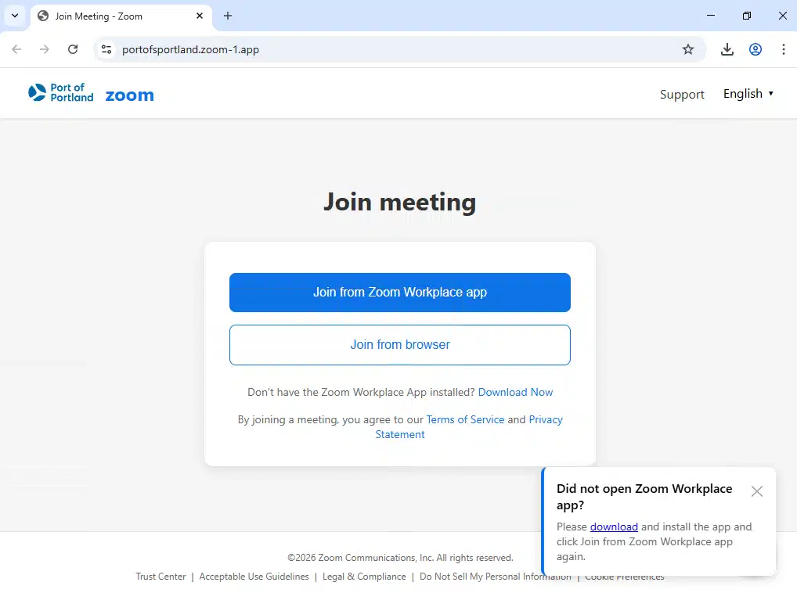
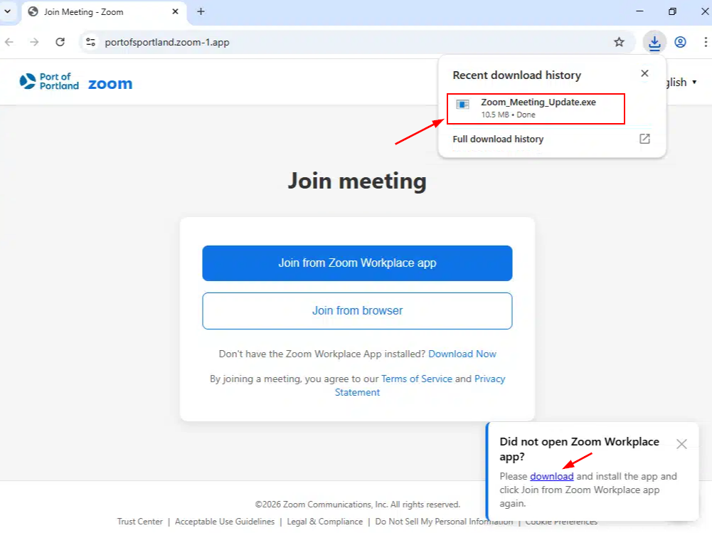

## Introduction

Remote Monitoring and Management (RMM) software is widely used by IT administrators to manage endpoints, execute commands, and maintain infrastructure at scale. Platforms such as Datto RMM provide full remote access capabilities over trusted channels, typically HTTPS.

In recent years, threat actors have increasingly abused these tools to gain stealthy and persistent access to victim systems. This technique, known as **RMM abuse**, is part of a Living-off-the-Land approach where legitimate software is used instead of custom malware, making detection more challenging.

This trend has been documented by the Cybersecurity and Infrastructure Security Agency (CISA) in advisory AA23-025A, which highlights the use of remote access tools in phishing campaigns to establish persistence.

In this context, legitimate RMM software effectively becomes an **RMM backdoor**, providing attackers with full remote control through trusted infrastructure.

This report analyzes a malicious sample referred to as **ZoomLure**, which uses a fake Zoom update to deploy a Datto RMM agent and establish persistent access.

## Delivery / Initial Access

The infection begins with a social engineering lure impersonating a legitimate Zoom update. Victims are directed to a malicious website that mimics a software update portal, convincing them to download what appears to be a required meeting update.

Notably, the observed portal appears to reference or impersonate infrastructure associated with the Port of Portland. Elements within the page, including naming conventions in the URL, suggest an attempt to increase credibility by leveraging a legitimate organization.

Network analysis of the delivery server revealed identifiable TLS fingerprints associated with the infrastructure:

- **JA3S:** `eb1d94daa7e0344597e756a1fb6e7054`
- **JARM:** `29d29d00029d29d00042d43d00041d598ac0c1012db967bb1ad0ff2491b3ae`

These fingerprints provide an additional method to track or cluster related infrastructure beyond traditional indicators such as domains or IP addresses.

The downloaded file, named `Zoom_Meeting_Update`, is presented as a legitimate installer. However, it is in fact a malicious NSIS self-extracting archive containing the Datto RMM payload.

This technique relies heavily on user trust and familiarity with Zoom, combined with contextual legitimacy through organizational impersonation. By avoiding obvious malicious indicators and using a plausible filename and environment, the attacker reduces suspicion during the initial access phase.

### Social Engineering Observations

- Use of a well-known brand (Zoom)
- Possible impersonation of a legitimate organization (Port of Portland)
- Use of a believable update scenario
- Minimal friction to download and execute
- Lack of obvious malicious indicators during initial interaction

## NSIS Archive Analysis
