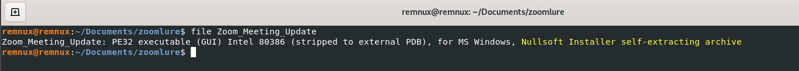
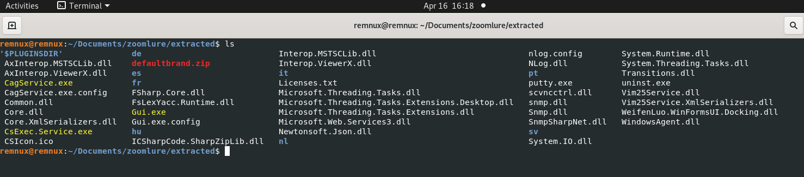
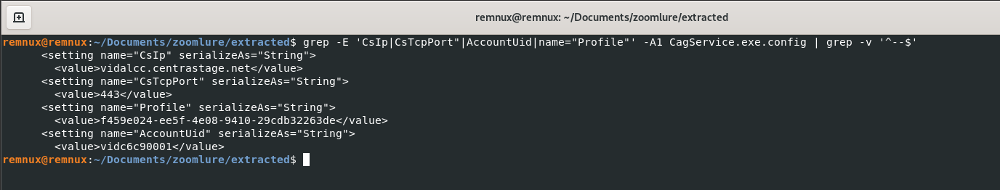

## Introduction

Remote Monitoring and Management (RMM) software is widely used by IT administrators to manage endpoints, execute commands, and maintain infrastructure at scale. Platforms such as Datto RMM provide full remote access capabilities over trusted channels, typically HTTPS.

In recent years, threat actors have increasingly abused these tools to gain stealthy and persistent access to victim systems. This technique, known as **RMM abuse**, is part of a Living-off-the-Land approach where legitimate software is used instead of custom malware, making detection more challenging.

This trend has been documented by the Cybersecurity and Infrastructure Security Agency (CISA) in advisory AA23-025A, which highlights the use of remote access tools in phishing campaigns to establish persistence.

In this context, legitimate RMM software effectively becomes an **RMM backdoor**, providing attackers with full remote control through trusted infrastructure.

This report analyzes a malicious sample referred to as **ZoomLure**, which uses a fake Zoom update to deploy a Datto RMM agent and establish persistent access.

## Delivery / Initial Access

The infection begins with a social engineering lure impersonating a legitimate Zoom update. Victims are directed to a malicious website that mimics a software update portal, convincing them to download what appears to be a required meeting update.

Notably, the observed portal appears to reference or impersonate infrastructure associated with the Port of Portland. Elements within the page, including naming conventions in the URL, suggest an attempt to increase credibility by leveraging a legitimate organization.


Network analysis of the delivery server revealed identifiable TLS fingerprints associated with the infrastructure:

- **JA3S:** `eb1d94daa7e0344597e756a1fb6e7054`
- **JARM:** `29d29d00029d29d00042d43d00041d598ac0c1012db967bb1ad0ff2491b3ae`

These fingerprints provide an additional method to track or cluster related infrastructure beyond traditional indicators such as domains or IP addresses.

The downloaded file, named `Zoom_Meeting_Update`, is presented as a legitimate installer. However, it is in fact a malicious NSIS self-extracting archive containing the Datto RMM payload.

This technique relies heavily on user trust and familiarity with Zoom, combined with contextual legitimacy through organizational impersonation. By avoiding obvious malicious indicators and using a plausible filename and environment, the attacker reduces suspicion during the initial access phase.


### Social Engineering Observations

- Use of a well-known brand (Zoom)
- Possible impersonation of a legitimate organization (Port of Portland)
- Use of a believable update scenario
- Minimal friction to download and execute
- Lack of obvious malicious indicators during initial interaction

## NSIS Archive Analysis

The sample is a Nullsoft Scriptable Install System (NSIS) self-extracting archive. Although NSIS is commonly used for legitimate software distribution, it is also frequently abused to package and deploy multi-component malware.

In this case, the installer does not immediately expose its malicious functionality. Instead, the outer executable acts as a container for a larger set of embedded components, which only become visible after enumeration and extraction.

A quick file identification confirms the use of an NSIS installer:

```bash
file Zoom_Meeting_Update
```


This is an important detail because it explains why the sample appears relatively generic during initial static inspection. Much of the relevant functionality is compressed within the archive rather than exposed directly in the outer binary.

Enumerating the archive contents reveals that the sample contains far more than a single dropped payload:

```bash
7z l Zoom_Meeting_Update
```
The archive includes executables, DLLs, and configuration files associated with Datto RMM, including `CagService.exe`, `CsExec.Service.exe`, and `Gui.exe`. This strongly suggests that the installer is intended to deploy a complete remote management stack rather than a simple loader.

Once extracted, the full structure becomes clearer:
```bash
7z x Zoom_Meeting_Update -o./extracted
```


The extracted contents show a complete deployment package containing service binaries, remote access components, and configuration files. At this stage, the sample is better understood as a packaged Datto RMM installation delivered through a malicious NSIS wrapper.

This packaging choice also has detection implications. Because the outer binary is a common NSIS stub and the core artifacts are embedded internally, generic signatures against the wrapper are less reliable. In practice, analysis and detection are more effective once focused on the extracted payload, configuration files, and resulting host and network artifacts.


## Payload Analysis: Datto RMM (CentraStage)

After extracting the NSIS archive, the payload reveals itself as a full Datto RMM (CentraStage) agent deployment. Rather than introducing custom malware, the installer deploys a legitimate remote management platform configured under attacker control.

This approach shifts the analysis focus from binary-level indicators to configuration, persistence, and operational artifacts.

---

### Identifying the Core Backdoor Component

The most critical component is `CagService.exe`, which acts as the primary service responsible for maintaining persistence and communicating with the remote infrastructure.

Its associated configuration file contains the most valuable network indicators:

```bash
grep -E 'CsIp|CsTcpPort"|AccountUid|name="Profile"' -A1 CagService.exe.config | grep -v '^--$'
```




